# 🏢 AWS Identity Center Management

> **Part of Infrastructure as Code (IaC) Portfolio**

A modern, scalable Terraform solution for centralized AWS access management across your organization.

---

## ✨ What This Does

**Simplify AWS Access Management** - No more juggling multiple AWS accounts, users, and permissions. This project creates a single source of truth for who can access what, when, and where across your entire AWS infrastructure.

🎯 **One Dashboard, Multiple Accounts** - Manage access to development, staging, production, and security accounts from one central location

👥 **Team-Based Permissions** - Assign developers, admins, and auditors exactly the right level of access they need

🔒 **Enterprise Security** - Built-in best practices with session timeouts, least privilege access, and audit trails

---

## 🚀 Key Benefits

| Feature | Benefit |
|---------|---------|
| **🎛️ Centralized Control** | Manage all AWS account access from one place |
| **⚡ Quick Onboarding** | Add new team members in minutes, not hours |
| **🛡️ Security First** | Role-based access with automatic session timeouts |
| **📊 Multi-Account** | Seamlessly work across dev, staging, and production |
| **🔄 Version Controlled** | All changes tracked and auditable |

---

## 🏗️ What Gets Created

### 🎭 **Permission Sets** (Role Templates)
- **AdminAccess** - Full control for platform administrators
- **DeveloperAccess** - Development tools with security guardrails  
- **ReadOnlyAccess** - View-only access for auditors and managers

### 👤 **User Assignments**
- Map your team members to appropriate permission sets
- Control which AWS accounts each person can access
- Set session timeouts based on security requirements

### 📋 **Custom Policies** 
- Fine-grained permissions stored as separate policy files
- Easy to review, edit, and version control
- Reusable across different permission sets

---

## 🎯 Perfect For

- **🏢 Growing Companies** - Scale AWS access as your team grows
- **🔒 Security-Conscious Teams** - Implement enterprise-grade access controls
- **🚀 DevOps Teams** - Automate user management with Infrastructure as Code
- **📊 Multi-Account Setups** - Manage complex AWS Organizations effortlessly

---

## 🛠️ Technologies Used

<div align="center">


</div>

---

## 📈 Project Impact

```
Before: Manual user management across 3+ AWS accounts
└── ⏱️  2-3 hours to onboard new team member
└── 🔄  Manual permission reviews
└── 😰  Risk of over-privileged access

After: Automated, centralized access management  
└── ⚡  5 minutes to onboard new team member
└── 📊  Automated audit trails
└── 🔒  Least-privilege access by default
```

---

## 🎨 Architecture Overview

```mermaid
graph LR
    %% AWS Organization and Identity Center (top layer)
    subgraph ORG["🏢 AWS Organization"]
        IC["🔐 Identity Center<br/><b>Central SSO Hub</b>"]
        
        %% Users (connect to Identity Center)
        A1["👨‍💼<br/><b>Admins</b>"]
        A2["👩‍💻<br/><b>Developers</b>"] 
        A3["👁️<br/><b>Auditors</b>"]
        
        A1 --> IC
        A2 --> IC
        A3 --> IC
    end
    
    %% Multi-Account Structure
    subgraph ACCOUNTS["🏗️ Multi-Account Structure"]
        E["☁️<br/><b>Management<br/>Account</b><br/>"]
        F["🧪<br/><b>Sandbox<br/>Account</b><br/>"]
        G["🔒<br/><b>Security<br/>Account</b><br/>"]
    end
    
    %% Identity Center manages access across all accounts
    IC -.->|"Manages Access"| ACCOUNTS
    
    %% Access flows from Identity Center through permission sets
    IC -.->|"🔑 Full Admin"| E
    IC -.->|"🔑 Full Admin"| G
    IC -.->|"⚡ Developer Tools"| F
    IC -.->|"👀 Read Only"| E
    IC -.->|"👀 Read Only"| F
    IC -.->|"👀 Read Only"| G
    
    %% Styling with black text
    style ORG fill:#f0f4ff,stroke:#1976d2,stroke-width:3px,color:#000000
    style ACCOUNTS fill:#f0fff0,stroke:#388e3c,stroke-width:3px,color:#000000
    style IC fill:#fff3e0,stroke:#f57c00,stroke-width:4px,color:#000000
    style A1 fill:#ffebee,stroke:#d32f2f,stroke-width:3px,color:#000000
    style A2 fill:#e8f5e8,stroke:#388e3c,stroke-width:3px,color:#000000
    style A3 fill:#e1f5fe,stroke:#0288d1,stroke-width:3px,color:#000000
    style E fill:#f3e5f5,stroke:#7b1fa2,stroke-width:3px,color:#000000
    style F fill:#e8f5e8,stroke:#388e3c,stroke-width:3px,color:#000000
    style G fill:#ffebee,stroke:#d32f2f,stroke-width:3px,color:#000000
```



---

## 🚦 Getting Started

### 📋 **Prerequisites**
- AWS Organization with Identity Center enabled
- Terraform installed locally
- AWS CLI configured with SSO

### ⚡ **Quick Deploy**
```bash
# 1. Clone and navigate
git clone <repository>
cd "AWS Identity Center"

# 2. Configure your settings
# Edit terraform.tfvars with your team details

# 3. Deploy
terraform init
terraform plan
terraform apply
```

### 🎯 **Customize**
Edit `terraform.tfvars` to add:
- Your team member email addresses
- Your specific AWS account IDs  
- Custom permission sets for your organization

---

## 📚 What You'll Learn

Building and using this project teaches:

- **🏗️ Infrastructure as Code** - Managing cloud resources programmatically
- **🔐 AWS Security Best Practices** - Implementing least-privilege access
- **👥 Identity & Access Management** - Centralized user and permission management
- **🔄 GitOps Workflows** - Version-controlled infrastructure changes

---

## 🌟 Part of Larger IaC Portfolio

This Identity Center project is one component of a comprehensive Infrastructure as Code portfolio, demonstrating:

- **☁️ Multi-cloud expertise** across AWS, Azure, and GCP
- **🛠️ Tool proficiency** with Terraform, CloudFormation, and Pulumi  
- **🏗️ Architecture patterns** for scalable, secure cloud infrastructure
- **📊 Enterprise solutions** for complex organizational requirements

---

## 🤝 Contributing

Found this helpful? Here's how you can contribute:

- ⭐ **Star the repository** if you found it useful
- 🐛 **Report issues** or suggest improvements
- 🔄 **Share your experience** with the implementation
- 💡 **Propose new features** or use cases

---

## 📞 Questions?

**Need help implementing this in your organization?**

- 📧 **Email**: [gio1818ggg@gmail.com]
- 💼 **LinkedIn**: [https://www.linkedin.com/in/jeejy30/]

---

<div align="center">

**🚀 Ready to streamline your AWS access management?**

*Deploy this solution and give your team secure, scalable access to your AWS infrastructure in under 30 minutes.*

---

*Built with ❤️ using Infrastructure as Code principles*

</div>